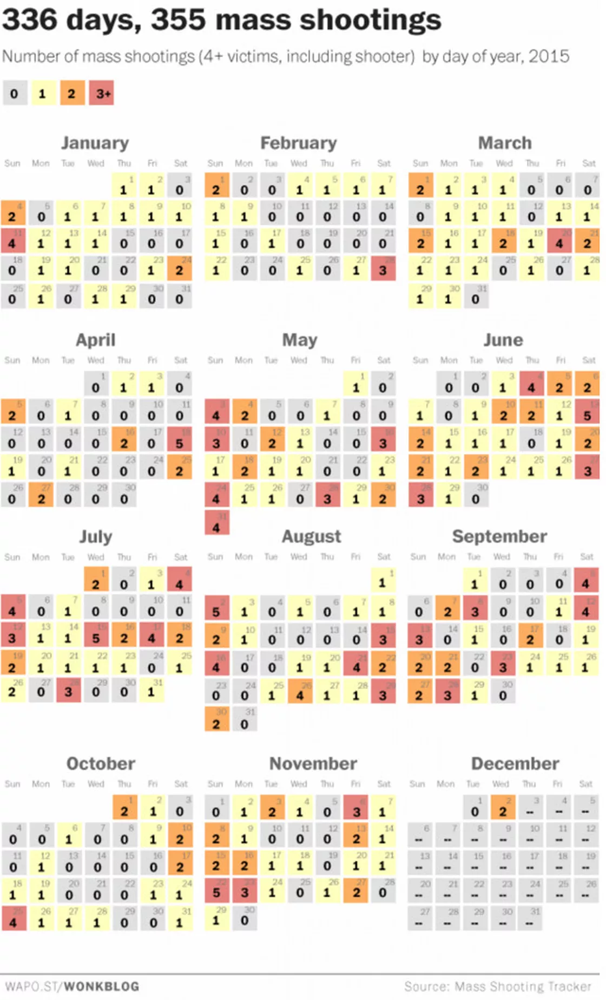
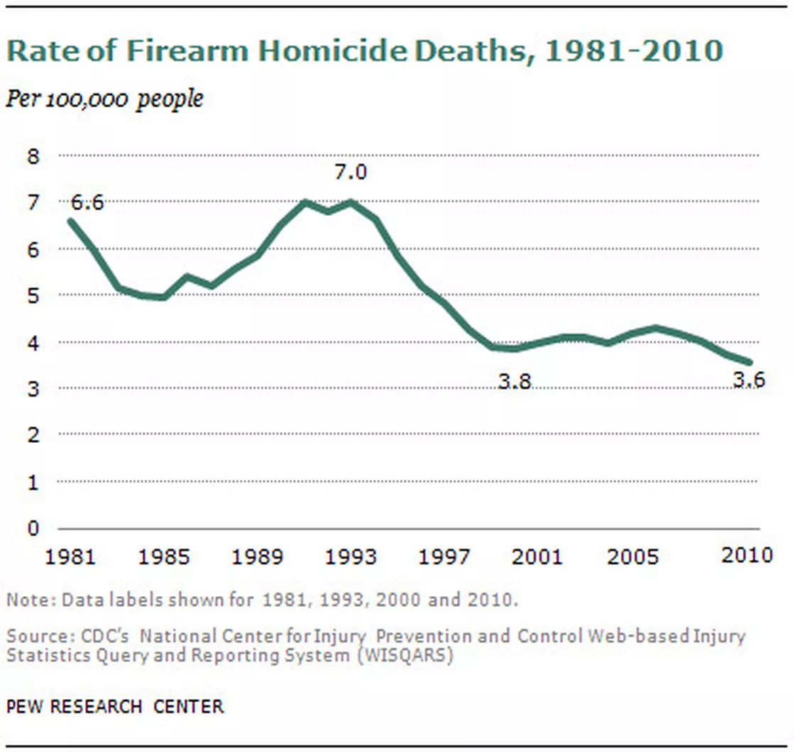

## Finding 1
In original data product, graph 4 drew distribution of mass shootings happened per day in 2015. From that we can see on average America has mass shootings almost everyday and it seems no difference of number of gun shootings from day to day, which made America like a crazy and dangerous country. 

However when replaced day distribution by month distribution, I found the original data product hide trend of mass shootings. In fact a clear trend shows in new chart, from May to Sep number of mass shootings are almost twice than the other months. 

### Making of:
Original data product try to explain a fact that America happens mass shooting everyday and its drew 300 more small grids, which make people feel gun problem is serious and gun shootings happen everyday. For thought with 300 more grids it is hard to tell trend and hide truth, I sum up daily accident and draw by month, with new chart I found summer leads gun shooting easily. In new chart I use months as x axis and shooting counts in each month as y axis.

Actually if draw by day it gives a micro view while by month we see a macro view. My chart distracts people's attention from everyday to those severe months, it make people feel America not happens gun shooting everyday but only in particular months. What government should do is not decrease number of guns but enhance security during summer.

### Road map with enhancements:
Check trend in different years to see whether summer is always a peak of gun accidents and if so find reasons of it. 

## Finding 2
In original data product, graph 9 shows a slow decreasing trend of gun homicides from 1990 to 2010. It used rate of gun homicides death per 100,000 people. From this grpah audience feel firearm homicides have declined over past two decades. 

However when I replaced y axis with count instead of rate, the trend changes. From new chart we can see different from trend has been decreasing recently, total number of death actually behave more like a wave. It decrease from 1980 to 1984 then increase, arrive a peak in 1993, decrease from 1993 to 2000 and after that it increase again. In a word, trend in past two decades is not a decrease but it just arrive a low ebb in 2000 and will increase again in future.

### Making of:
Instead using rate of death per 100,000 people, I changed y axis into absolute count. Because thirty years is a long time period and population in America changed a lot (1980:226,545,805,2010:308,745,538), if only use rate as y axis it may hide truth. Using absolute count audience can see the real situation and trend. 

When drawing chart I found if add 2009 and 2010 which show little decrease, the increasing trend after 2000 will be affected so I remove year 2009 and 2010. 

### Road map in future:
Try to find gun homicides count after 2010 and to see if there is a clear increasing trend.

## Finding 3
In original data product, graph 15 shows trend of control gun ownership and protect right of own guns in recent twenty decades. From graph we see more and more people began protect the right of own guns and less people support control gun ownership. 

But when go deeply to dataset I found not all races tend to support right of own guns. In new chart I drew, we can see actually white race are big fan for gun owning, from 2007 white people's number of support gun right surpass number that control gun right. However when we see Black and Hispanic people, their lines of control and protect are almost two parallels. In another word, no much changes showed among black and hispanic people.

### Making of:
When looking at original dataset, I found except overall view it also shows other classification such as gender, age, race, education and etc. After drew chart for each classification I found different classification show various trend. Then I pick race instead overall which used by original product as x axis, for race different from original chart most. 

I think changing x axis to race make audience pay attention to difference between white people and other races. It is not all people in America tend to support gun ownership but only white people do, and else races still tend to control gun ownership. 

During process explore dataset, I found except race other classification also show different trend from original dataset. But race show most obvious difference, I chose use race as x axis.

### Road map for enhancement:
Draw graph for every classification to see people with what kind of characters tend to support gun ownership and vice verse. 

## Reference
1. USA population [https://en.wikipedia.org/wiki/Demography_of_the_United_States]
2. Gun homicides information [https://www.cdc.gov/injury/wisqars/]
3. Mass shootings [https://www.vox.com/a/mass-shootings-sandy-hook]
4. Public views about guns [http://www.people-press.org/2017/06/22/public-views-about-guns/#gunowners]
