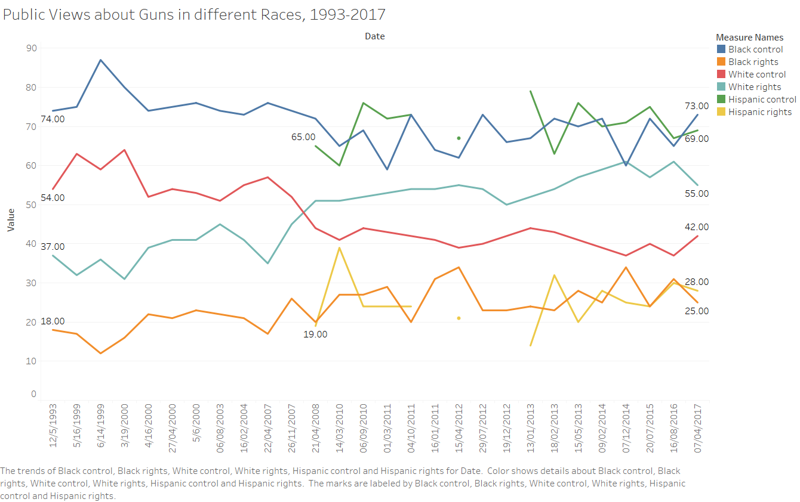

# Revised Version
## Zhonghe Han 00001425699
## Redesign
### Finding 1
### Improvement
#### Original and first 
In first version graph I showed trend of sum number records for mass gun shooting from 2014 to 2018. From the chart we can see it told mass gun shooting in America arrived its peak in 2016 and then fall down in 2017 and different from view 'mass shooting increasing after 2012' presented by original data product. Compare to first version which is unclear by only showing average lines, this time I change lable on average into specific mean number and added a trend line to show rise and fall from 2015 to 2017.

#### After revise
However this trend is different from common sense and frequent mass shooting make us feel terrorist never reduce their willing to shoot. Is people really decreased willing of using guns or there is other reason? From some essays I found reason for decreasing gun shooting in 2017. Since new policy make fears of tighter controls to buy guns fade, people tend not buy guns rushly and gun sales decline in 2017. We may say less gun selling lead to decrease of mass gun shooting though people didn't do this consciously. There maybe other reasons but this one can explain part of decreasing. From chart below we can see relation between gun selling and mass shooting. I use data of number for background checking when buy guns as y axis and year as x axis.

Public link: https://public.tableau.com/profile/zhonghe.han#!/vizhome/backgroundcheck/Sheet1?publish=yes
### Polishing
Considering data pixel principle, I think use specific average number as lable is better than just drew an average line for numbers are more direct. Then I decide to find more explaination for the chart which only shows a fact. Following GQM model, I tried to find goal of my data product. The goal should be showing how serious gun problem is and America should decrease gun amounts, in other words my charts should make people feel it is necessary to control guns. Question rise from my chart then become what is true reason of mass shooting decreasing, reaon that can support my goal. Finally from essays I found president Trump's friendly-gun attitude can be used here, so metric become background checking when buy guns. With this reason, my chart shows it is decreasing of buying gun make mass gun shooting decrease therefore it is necessary to control guns.

### Finding 2
### Improvement
#### Original and first
From first version chart I drew, I tried to show relation between firearms number and homicide by firearm. But due to included all countries with pile lable names and didn't sort any variable, the chart seems confused and disordered. We cannot tell how America perform compare to other countries. 

#### After revise
In revising chart, I choose to draw these two variables in two different charts and both as y axis with same countries name as x axis. In this way it is easier for audience to see gun amount and homicide by firearm among countries. Also I only use developed countries instead all countries, for I think America is a developed country also this make chart more clear. From this chart, we can see average firearms per 100 people in America is twice than the second country and its number is around 90, which means a higher gun ownership rate that in 100 American 90 of them have gun. Also, number of homicide by firearm per 100k people in America is top one and almost four times than second country. This actually prove original data product's claim, more guns lead to high homicide by firearm but more clear than original one, which only shows number of homicide by firearm. 

Still finding 2 enhance conclusion of finding 1, more guns do lead to more gun related events.

public link: https://public.tableau.com/profile/zhonghe.han#!/vizhome/Developde_countries_gun/Sheet4?publish=yes
### Polishing
Finding 2 is based on chart 1 in original data prodcut. When thinking how to improve it, I followed the audience model. For conclusion of chart 1 in original data product, it said more firearm homicides in America is because it has way more guns than other developed nations, I thought this as what audience 'want'. According to this, I think audience 'need' metrics such as guns amount in all developed countries. Also I should avoid what audience 'fear', that would be including other developing countries in chart, because as we known some developing countries are war countries and their data will make America no longer an outlier. Thus, I only include developed countries and found firearms owned number. 

### Finding 3
### Improvement
#### Original and first
From first version chart, I tried to explain relation between gun related laws and firearm death rate. However in first version, I piled up states with same numer gun related laws together in one same bar, which was a bad way to show relation and easily became a misleading chart. For instance, in that chart it seems states with one law term tend to have more firearm death than states without any law (which is not true), for number of states with one law is more than number of states without law.

#### After revise
In my revising verison, I seperated states into three groups, states without law, states with one law and states with two more laws. Then instead piling up all states to one bar, using states name as x axis, firearm death rate per 100k people as y axis, I drew three charts for each group and showed average death number on chart. In this way, we can see relation between gun related laws and gun death easily. States without any gun laws average gun death is 15.53, in states with one law it decline to 13.79 and in states with two more laws it lower to 6.68. Therefore we may safely say more gun related laws lead to less gun related death.

public link: https://public.tableau.com/profile/zhonghe.han#!/vizhome/Gun_laws/Dashboard1?publish=yes

Also I drew a general chart include all states to show this relation by color. We can see from second chart, the deeper the color the more states have gun laws. And similarly, we see states with more laws tend to lower their firearm death number.  
Again finding 3 enhance previous two findings, by controlling guns America will have less gun death.

public link: https://public.tableau.com/profile/zhonghe.han#!/vizhome/Gun_laws/Sheet3
### Polishing
When making this chart I was confused by original data product as well as my first version. For somehow my charts contradicted with claim. After applied argumentation model, I built a connection between my data and claim. Base on dataset I had, which shows clear relation of states with two or more laws have lower gun death, I set up a claim that more guns laws lead to lower gun death. When checking whether my product is qualifier or not, I used average line of gun death for states in different laws level. And as displayed in chart above, since chart showed states with more gun laws have less gun death, it support my claim well. Also more gun laws leading to less gun death is a common sense which fit to my understanding, this is a good backing. 

## Deception
### Finding 1
### Improvement
#### Original and first
From first deception version, I tried to show trend of mass shooting by months of 2015 and claimd America is not a crazy war country which has indiscriminating mass shooting everyday. We can see compare to original data product chart 4, my first version make people focus on mass shooting happened in summer but not everyday. I want to explain we shouldn't pass the buck to gun blindly but enhance security in summer.

#### After revise
For in old version it only showed one year which is not representative enough. In revise version, I expanded range from 2014 to 2017, which can tell if 2015 was only an outlier. Here I changed month to quarter and can tell seasons trend more easily. Clearly from chart below we can see always mass shooting records increase from second quarter and arrive peak in third quarter which is exactly summer.

public link: https://public.tableau.com/profile/zhonghe.han#!/vizhome/mass_quarter/Sheet1?publish=yes

According to essays of ANDREW W. LEHREN and AL BAKER in 2009, people tend to crime in heat of summer. Summer is when people get together. More specifically, casual drinkers and drug users are more likely to go to bars or parties on weekends and evenings. These people in the social mix, flooding the city’s streets and neighborhood bars, feed the peak times for murder. So if government and people who tend control gun want to do something, it is better to begin from security problem in summer.

### Polishing
When drawing first version chart I followed the audience model. A little difference from original model, I changed main model from audience to the author of original data product. That author try to rebut gun supporters to say gun shootings never stop, this is what they want. Their metric showed mass shooting is happening everyday then what they fear become evidence showing a stop of gun shootings. Following this, I replaced day distribution with month distribution, which shows a 'stop' in seasons except summer. Though my chart didn't show exactly disappearance of mass shootings, it changed no difference trend into rise and fall trend. 
### Finding 2
### Improvemet
#### Original and first
My finding 2 in first deception version showed trend of gun homicides from 1994 to 2009. To rebut original data product, I changed homicide rate into homicide count and remove years before 1994. Then my chart told a fall and rise trend of gun homicides over past decades. Compare to original chart which included a high homicides around 1990 and hide the small increasing trend after 2000, my first version excluded year before 1994 to outstand the rising after 2000 and showed a different trend. 

#### After revise
Since my first deception version only till year 2009 and far away from now, it is less persuasive. I added data from 2009 to 2016 and update my chart. From new chart below we can see another fall and rise after 2006. Still peak in 2016 in new chart is lower than peak in 1994, which means if follow year range of original data product audience cannot see the increasing trend after 2014 because that high number in 1994 will hide other peak. 

public link: https://public.tableau.com/profile/zhonghe.han#!/vizhome/1994-2016_gun_homicides/Sheet2?publish=yes

Therefore my new chart continue contradicts original data product, no any good news in firearm homicides and it increase heavily during recent years. This enhance my claim in previous findings, gun related death is increasing and American should control guns anyhow.
### Polishing
Since original data product showed a trend of decreasing, my deceptive version should have an opposite claim from original claim. For I already have a clear goal, I followed GQM model. Based on my goal, my question become finding rising years in dataset. According to this question, I designed my metric with: removing year before 1994 which may hide later rising trend, using count instead rate which has no clear rising trend in recent decades and adding latest data till 2016 which showed explicit rising trend and helped to solve the question. 
### Finding 3
### Improvement
#### Original and first
In first deception version I tried to explain not all races in America support gun rights. In that chart I seperated group by races and showed each race's willing of gun right and gun control. Compare to original data chart which gave an overall view of all races and make audience feel more and more American support gun right, my chart showed only white race tend to support gun right while black and hispanic race's willing of control gun are still strong as twenties year ago. 

#### After revise
But when looked at my first version graph I felt little confused because the colorful line chart. In my old chart I used different color for same race's gun right and gun control willing, which is not direct and hard to read. In new version I edited color using similar color for same race and darker color for gun control, lighter color for gun right. 

public link: https://public.tableau.com/profile/zhonghe.han#!/vizhome/races_view/Sheet1?publish=yes

Also I tried to find more characters for people who tend to support gun control within dataset. Then I found people who from Urban, with race of black and hispanic, ideology are liberal and from Democrat party tend to control guns. But since so many catagories are included in this chart, it is not easy to see. It become a flaw for this chart.

public link: https://public.tableau.com/profile/zhonghe.han#!/vizhome/pubilcview/Sheet1?publish=yes

With my deceptive chart, I rebutted original data product from a micro view. Instead looking overall view I grouped people by different characters and gave a contradictive picture compare to original data product. 
### Polishing
When revising my second version chart, I was thinking data pixel ratio mentioned in class. Since my first version looks confused I was thinking how to make an aesthetic visualization. Then I changed colors that didn't help to explain my data and even draw audience attention with no good reasons. In my final version I tried to keep three main color to represent each race. Also I kept lable number both at start and end of line to help explain white race tend to support gun right and the other two races tend to control guns. 

Also at first when design this deceptive chart I followed audience model. I see myself as audience and what I want is opposite from original data product, that would be show American are not tending to support gun rights. Then I think I need data that show keeping trend of control gun to support my 'need'. With different characters of people, I found drawing chart from micro view can support my claim. Relativly, I fear those characters which show an increasing trend of supporting gun rights and that would be rebuttal of my claimi, so I didn't include those characters in my second revise chart.
## Reference
1. USA population [https://en.wikipedia.org/wiki/Demography_of_the_United_States]
2. Gun homicides information [https://www.cdc.gov/injury/wisqars/], [http://www.gunpolicy.org/firearms/region/united-states]
3. Mass shootings [https://www.vox.com/a/mass-shootings-sandy-hook]
4. Public views about guns [http://www.people-press.org/2017/06/22/public-views-about-guns/#gunowners]
5. Data Pixel Approach [https://www.smashingmagazine.com/2011/11/the-data-pixel-approach-to-improving-user-experience/]
6. Number of Killings Rises With Heat [https://www.nytimes.com/2009/06/19/nyregion/19murder.html]
7. FBI gun background check [https://www.fbi.gov/file-repository/nics_firearm_checks-month_year.pdf/view ]
