# Revised version -- Higher Education
## Feng Wang, Jieyi Deng, Tianmin Li, Yingjie Yu, Zhonghe Han

## Introduction
This project is looking at college education related data to see how college education changes over time and how does it affect people. Specifically, we are looking at the following research questions:

What college majors are trending over years?

How does the most popular college majors vary across gender?

What is the relationship between college majors and occupations?

This paper looks at the three research questions listed above and tries to find reasons behind them.

## Data Collection, Cleaning and Integration
Primary Dataset: ACS PUMS 2012-2016
### Data Collection
Our dataset comes from United States Census. This dataset is about American Community Survey PUMS Data from 2012-2016, covers data from housing record to person record. Specificlly, from this dataset we know more about jobs and occupations, educational attainment, veterans, whether people own or rent their homes, and other topics. We choose related variables from that to help us know more insight of education. 

### Data Used and Explanation
All variables we chose from our dataset are based on our exploration/research questions. First we want to see most popular majors over year and across states. So we picked up 'ST' which means different states, 'SERIALNO' gives identical number for each interviewee and include survey time. 'Fod1p' stand for specific majors. Also 'AGEP' means the exact age when people did that survey. With this four variables we can get data of people's college enrollment year, their majors and location. 

Second we want to know most popular college majors across gender and race over years, for this question we need variables of people's majors, gender and race. Therefore we chose variables of 'SEX' which stand for male and female, as well as 'RAC1P' show race of people. 

Then we care the most lucrative majors over years, here we need information of people's income and their major when graduated. We already had major data, so we included 'pincp' which means people's total income(any income sources). 

Last we are interested in realtionships between college and occupations, here we need people's major and which industry field they entered after graduated. To consider it throughly, we included both 'INDP' and 'NAICSP' mean different classify method, first one is industry recode and later one is code of North American Industry Classification System. 

Except variables mentioned above, we also included variable like 'ADJINC', means adjustment factor for income and earnings dollar amounts which helps us capture income more precisely,taking inflation into consideration; 'SCH','SCHG' and 'SCHL' help us segment people by with or without college experience, also college catagory; 'CITWP' which means if people were naturalized and when, we would like to see relation between immigration and major choice also its effect to state enrollment; 'COW' which stands by worker catgory, we think different major may lead to different work class. 

Here is a table of variable description.

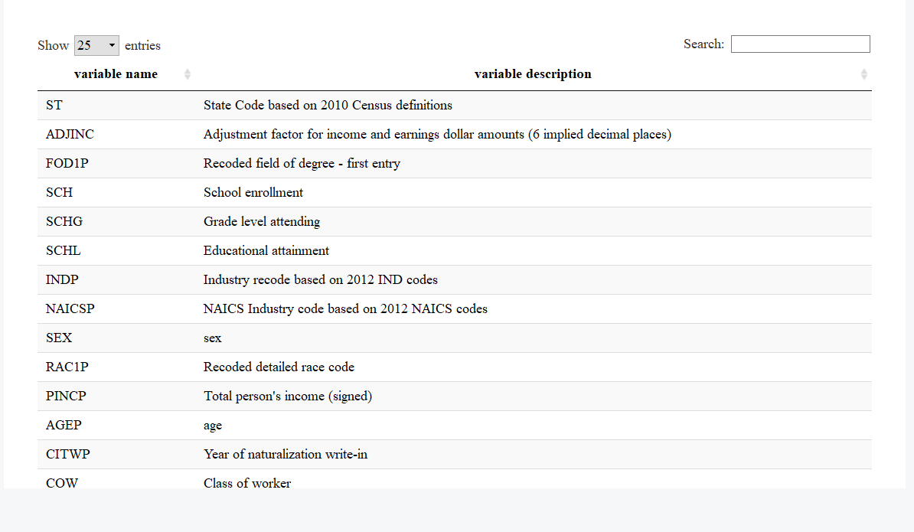

### Data Cleaning and Integration
Data used for the projects come from US Census Bureau and Centers for Disease Control and Prevention. Following are the data cleaning process to retrieve the information we need to answer the research questions.

Read and Combine Raw Data
```{r}
library(data.table)
census1 = fread('ss16pusa.csv')
census1 = census1[,c("ST","ADJINC","FOD1P","SCH","SCHG","SCHL","INDP","NAICSP","SEX","RAC1P","PINCP","AGEP","CITWP","COW","SERIALNO")]
census2 = fread('ss16pusb.csv')
census2 = census2[,c("ST","ADJINC","FOD1P","SCH","SCHG","SCHL","INDP","NAICSP","SEX","RAC1P","PINCP","AGEP","CITWP","COW","SERIALNO")]
census3 = fread('ss16pusc.csv')
census3 = census3[,c("ST","ADJINC","FOD1P","SCH","SCHG","SCHL","INDP","NAICSP","SEX","RAC1P","PINCP","AGEP","CITWP","COW","SERIALNO")]
census4 = fread('ss16pusd.csv')
census4 = census4[,c("ST","ADJINC","FOD1P","SCH","SCHG","SCHL","INDP","NAICSP","SEX","RAC1P","PINCP","AGEP","CITWP","COW","SERIALNO")]
census = rbind(census1, census2, census3, census4)
```
The research questions we looked at for the project are related to college education. As a result, we are removing the records that have missing values for the field of degree(FOD1P). 
```{r}
census = census[!is.na(census$FOD1P),]
```
In order to understand how popular majors change over years, it is essential to know when did a person attend college. This information is not provided in the data set. To get around with the problem, we make an assumption that people attend college at 18. By substrating the age of the respondent from the year the person took the survey and then add by 18, we will be able to get the year of the person attending college based on the assumption. The year of the survey is not explicitly provided in the data but we are able to get this information by taking the first four digits of the GQ person serial number (SERIALNO). 
```{r}
census$survey_year <-substr(census$SERIALNO,1,4)
census$survey_year <- as.numeric(census$survey_year)
census$college_year<-census$survey_year - census$AGEP + 18
census = census[,c("ST","ADJINC","FOD1P","SCH","SCHG","SCHL","INDP","NAICSP","SEX","RAC1P","PINCP","AGEP","CITWP","COW","survey_year", "college_year")]
```
Get State Name by Merging State FIP code
```{r}
state <- read.csv("us-state-ansi-fips.csv")
colnames(state)[2] <- "ST"
census <- merge(x = census, y = state, by = "ST", all.x = TRUE)
```
Income Inflation Adjusts

Since the dataset covers surveys from 2012 - 2016, it is necessary to adjust income so as to make them comparable. Using the adjusted factor for income and earnings(ADJINC), we are able to get the total peronal income to 2016 dollars. 
```{r}
census$income_2016 <- census$ADJINC*0.000001*census$PINCP
census = census[,c("ST","FOD1P","SCH","SCHG","SCHL","INDP","NAICSP","SEX","RAC1P","AGEP","COW","survey_year", "college_year", "stname", "stusps", "income_2016")]
```
To see major names clearly we merge “census_final data with major_category data” in Tableau.

## Finding 1:  Elementary Education, General Education, Business, Nursing and Psychology are the most popular majors from 1935 to 2008
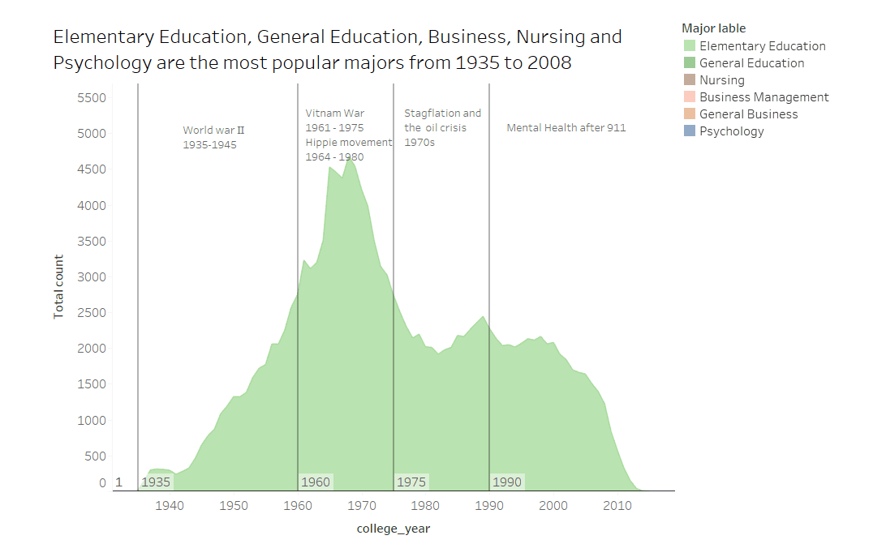
The graphs can be viewed on Tableau Public: [Link](https://public.tableau.com/profile/zhonghe.han#!/vizhome/Finding1_0/Dashboard1?publish=yes)

### Description: 
This chart shows the trends of top 6 majors over 80 years from 1935 to 2008. These six majors can be classified into four categories, including Education, Business, Nursing and Psychology. From the chart we can see that the most popular major between 1935 and 1970 was Elementary Education, with a peak in early 1970s. Majors such as Nursing and Psychology reached the local peaks in 1970 and 1973 respectively. From 1975 to 2000, two business majors gained large popularities fastly. Then they became the top two majors in this period and peaked in early 1980s. Starting early 2000s, Psychology gradually became the most popular major. 

### Development Process: 
To understand the popularity trend of majors over years, we use year as x-axis and frequency of responders’ college major as y-axis. Since we have many majors, the top six majors are chosen and the frequency is counted for each major by year. We chose top six instead of top five because we found the sixth is Nursing, which can help explain the trend of psychology as well (detailed explanation will be provided below).

### Improvement and applied principle
Compared to our first version, here we revised our charts in those aspects: 1) Removed all meaningless grids in background 2) Split original dynamic graph into four separate static charts following major categories 3) Changed color of majors, using similar color for majors belong to same category 4) Add data source below each chart to make them iterable. 
When revising, we followed some principle mentioned in class. First thing is rules of thumb when designing data product. We found in our first version chart, grids in background and multi colors were used which were meaning less and may misleading audience. So we removes grids and applied same color system for each category. Also we follow principle of GQM(goal, question and metrics). In our first finding, the goal is giving an overview of popular major over years. With this goal our question became how to show popular majors in different time period. In order to achieve, in our chart we should show trend of different major or say give a view for each major. However in our first version, there was only a dynamic chart which is good to show trend by year but bad example to show specific information in different period. In our revised version, we choose use static chart for each time period to show detail for each time period as well as one dynamic chart to show a overall trend.

### Reasoning：
After finding the most popular majors for years, we would like to further explore reasons that may explain the popularity in specific time periods. We found that social and culture events for different time periods may largely influence the majors selected by people. 

#### Education:
Both elementary education and general education were the most popular majors for around 40 years from 1935 to early 1975, and peaked in 1970s. One possible explanation to this phenomenon is that there was a huge increase in investment on education after world war Ⅱ, where both the local and state government find it necessary to encourage education and decrease the number of illiterate people (Max and Esteban, 2018). This increased the demand for teachers and more people were willing to study education in university. Also, great efforts were made in 1970s to increase education equalities and create opportunities for previously disadvantaged minorities such as African Americans, immigrants, the disabled, and women [1]. Many of these efforts met with success which further increased the demand for education. 

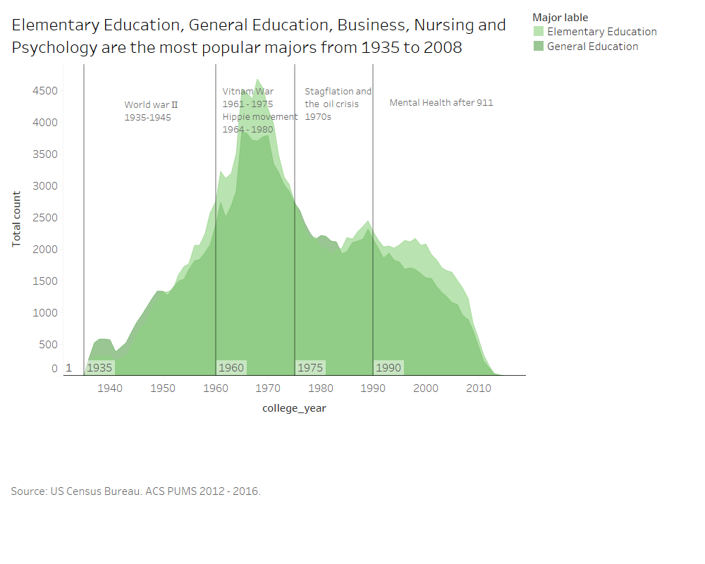

The graphs can be viewed on Tableau Public: 
[link](https://public.tableau.com/profile/zhonghe.han#!/vizhome/Finding1_0/education)

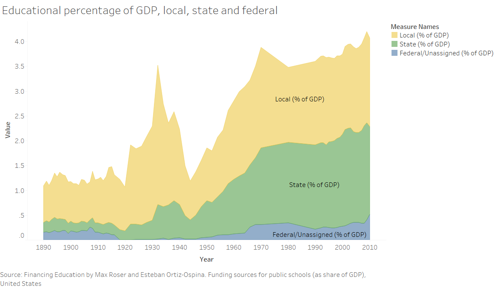

The graphs can be viewed on Tableau Public:
[link](https://public.tableau.com/profile/zhonghe.han#!/vizhome/Finding1_0/education
)

#### Nursing and Psychology
During 1960 to 1975, Nursing and Psychology became extremely popular and arrived their peaks while Vietnam War and hippie movement were happening. During that time, Nursing become a hot major because in Vietnam war, the army needed plenty of people who skilled at nursing. Based on Vietnam Women’s Memorial Foundation, approximately 11,000 military women were stationed in Vietnam during the conflict, and 90 percent of them served as military nurses (History.com Staff, 2011) [2]. 

Psychology was popular in this period as well. This might be explained by the fact that the United States ran an extensive program of psychological warfare during the Vietnam War, and many psychologists and counsellors were needed to help veterans for posttraumatic stress disorder [3]. From an issue published by Ibiza Times in 2015, The Psyop was used by the US government agencies to neutralize the anti-war movement in universities (Ibiza Times 2015). Hippie movement also happened in this period with topics related to spiritual level such as art, religion, drugs, love and sex. People tend to learn themselves well and studying psychology might be a quick path to do so. 

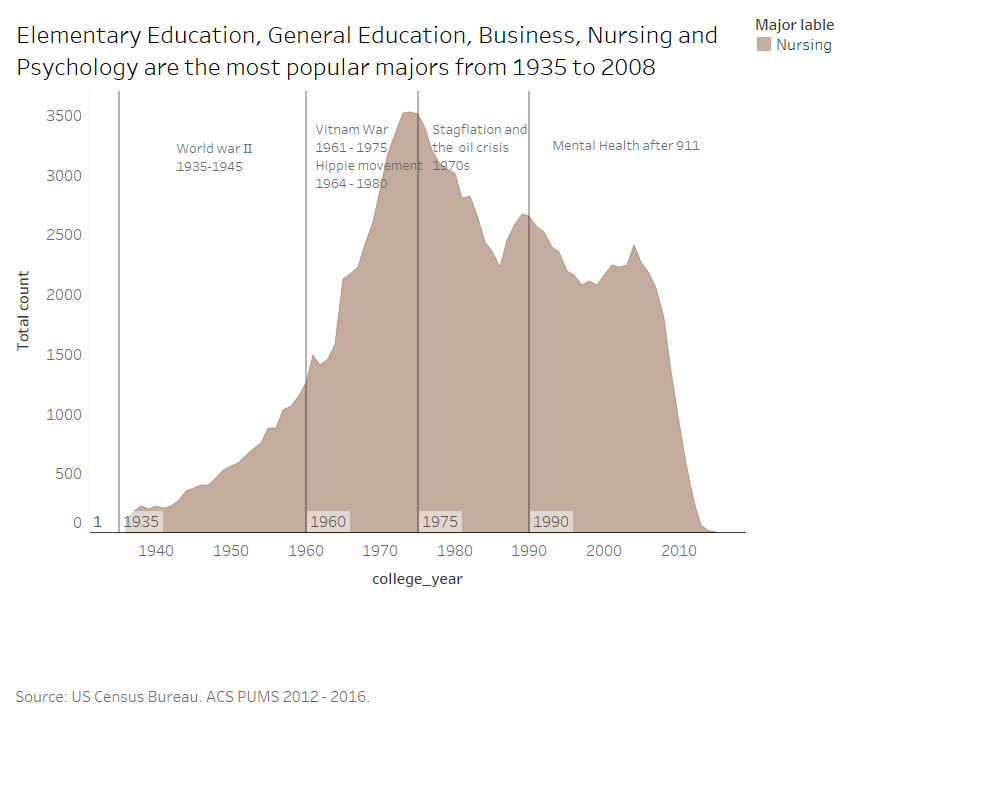

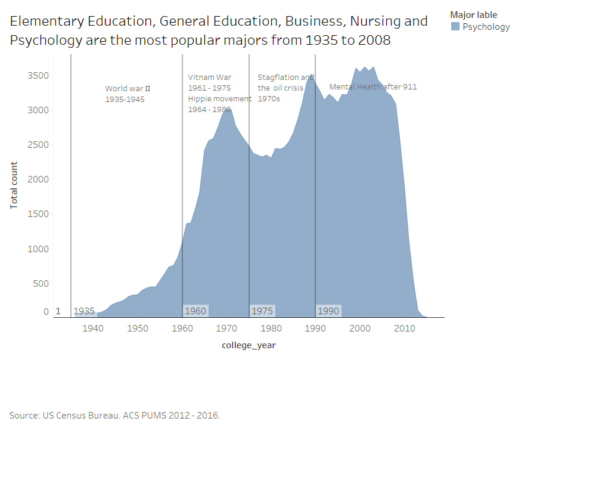

#### Business
Business related majors arrived their peaks and beat other majors significantly from 1970 to 2000. During that time oil crisis occurred, and the America or even the whole world came to stagflation. We think this is one reason behind peak of business major. For all industries entered their low ebbs and people tried to study business to better know world economy to save their families as well as their companies. Still more occupations in business fields occurred so it would be easier to find a job if study business at that time. 

Also we can find this claim in an essay, when mention 1970s the following things come to mind: High oil prices, Inflation, Unemployment, Recession. In December 1979, the price per barrel of West Texas Intermediate crude oil topped $100 (in 2016 dollars) and peaked at $117.71 the following April. That price level would not be exceeded for 28 years. [4] .

Though business was surpassed by other major, it was still a popular major and this will be explained in later finding. 

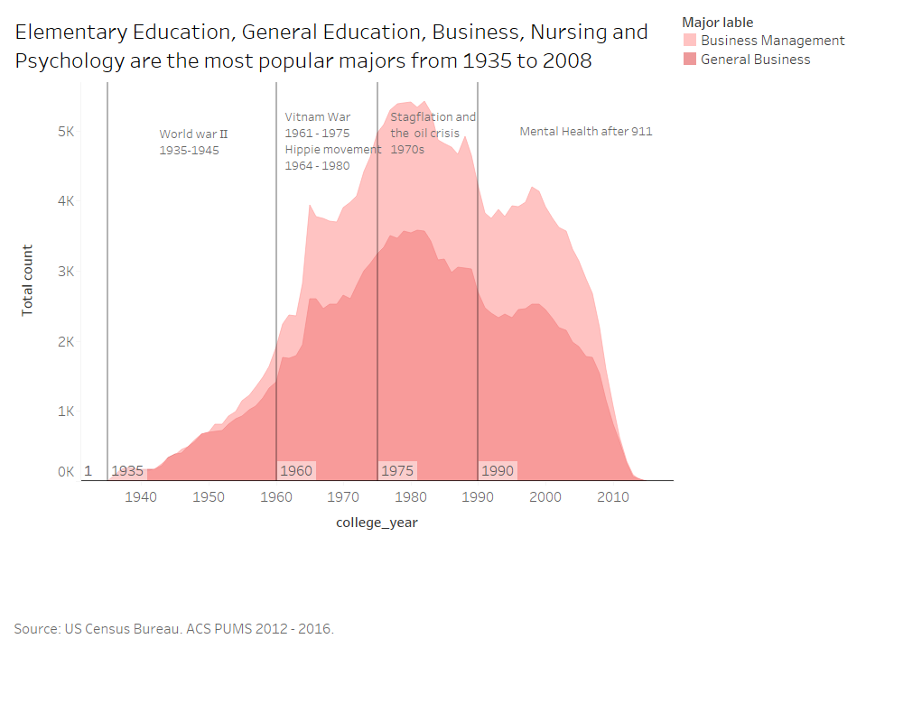
#### Psychology
In 21st century psychology surpassed business related major and became top one from 2003 to 2008. Actually from 1999, count of people majored in psychology grew faster  and arrived its peak in 2003. 

One possible explanation for this may be ‘September 11 attack’ happened in America in 2001, which hit Americans hard in both physical and mental level. Also in dataset provided by  National Center for Health Statistics, people expenditures on Mental health increased faster after 1998. Since demanding of psychotherapy increased, need of psychologists increase too also in order to release mental pain people tend to study psychology themselves.[5]


The graphs can be viewed on Tableau Public: 
[link](https://public.tableau.com/profile/zhonghe.han#!/vizhome/mentalhealth_2/Sheet1?publish=yes)

### Why this important to audience?
Here in finding one our potential audience are parents prepare to find proper majors for children. From what shows above we can see reasons between popular majors in different time period have huge difference and most tied tightly to social events. Therefore insight here can be parents cannot choose majors just follow trend blindly, not all reasons behind popular trend are high income. In fact this was what we expected previously, we thought higher payment should always be trigger when people looking for jobs. Then our chart tells the truth, complicated reasons push forward the development of society and people choose majors for different triggers.

## Finding 2:  Male and female are remarkably different in choosing their college majors, which could potentially be the reason of wage gap.
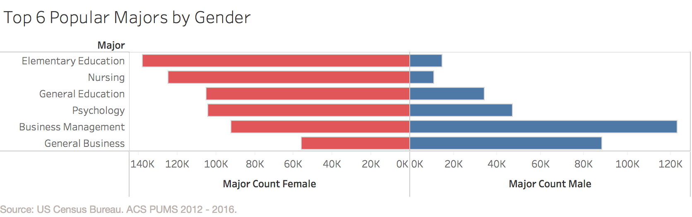

This graph presents the total count of the top six majors divided by gender, public file [link](https://public.tableau.com/profile/feng.wang2440#!/vizhome/top6popularmajorsbygender/Sheet1?publish=yes)

### Description
College education is a major investment in lifetime. Women increasingly participated in college education over years, and the total number of women’s degree holders outweighed that of men’s since 1980s [6]. However, in term of major preference, male and female were remarkably different: female students were more likely to choose Elementary/General Education as well as  Nursing as their majors, while male students prefered Business-related majors, as showed in the graph above. As a result, there is a gender pay gap since most men choose to major in higher-income fields of studies.

### Development Process 
After looking the overall popular majors, we explored the top six popular majors between gender. To explore major preference in gender, we grouped the processed data file by major and  by gender to summarize total count of majors. We choose the top six popular majors  in total count because of consistent with the previous finding, and we think it’s worth to further research the most popular majors in the perspective of gender. We then looked at relationship between major and income across gender since the major difference might be a driver to gender wage gap.

### Data Wrangling:
```{r}
# Major, Gender
data <-fread("census_final_from_R.csv")
summary(data)

data_gender = data[,c("gender","race","college_year","general.category","specialized.category","major","FOD1P")]

table = data %>% group_by(FOD1P,gender)%>% 
summarise(major_count=n())

# Income, Major, Gender
df <- fread("census_final.csv")

income_stats_by_gender <- df%>%
group_by(FOD1P,SEX)%>% 
summarise(Mean=mean(income_2016),Median=median(income_2016))


df_2 = dcast(income_stats_by_gender, FOD1P  ~ SEX, value.var = "Mean", fun.aggregate = sum) 
colnames(df_2) = c("code","male_mean_income","female_mean_income")
```
### Revised Version Comparison: 
Compared with the first version, we improved all of the graphs by deleting graph grid: the grids are useless and getting rid of them will decrease the data pixel ratio. Also, we added the revised title, captions, and data sources in the graphs to make our data products more readable and understandable to audience. Furthermore, we improved the graph “Average Income By Major Category” by replacing the old “colorful” graphs and using bright color to highlight, which fits the principle of analytic design.

### Explanation and Impacts on Wage Gap 
According to the Staff Report of Federal Reserve Bank of New York, gender difference in choosing majors could be explained by two factors: “innate abilities and diverge preferences” [7]. More specifically, when considering major options, female students pay much attention to non-pecuniary outcomes, such as gaining approval of parents and enjoying work at jobs, while male students emphasize on pecuniary outcomes, namely social status of the jobs, likelihood of finding a job, and earnings profiles at future jobs (2009). As a result, “differences in major account for a substantial part of the gender gap in the earnings of individuals with several years of college education” (2009).
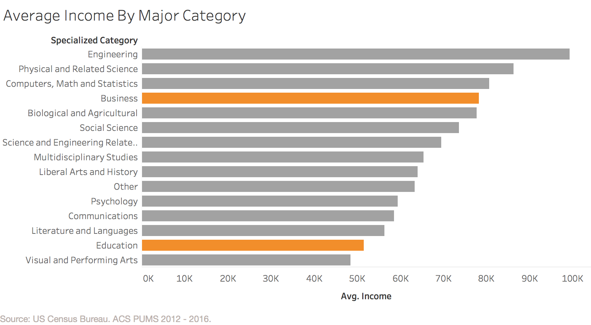

The graphs can be viewed on Tableau Public:
[link](https://public.tableau.com/profile/feng.wang2440#!/vizhome/major_income_finding2_exp/Sheet1?publish=yes)

The report is consistent with our finding. From the same dataset, we also explore the relationship between major and income. We generated the average income by specialized category of majors, which aggregated 170 majors into 15 border categories by ACS. From the graph, it easily stated that majoring in the fields of business would generate higher income than majoring in the fields of education: the mean income for business students was around $80,000 while the education students was only about $52,000. 

Combining with the finding that women prefered major in lower-earning fields, such as Education, while men prefer major in higher-earning fields, namely Business, we could easily conclude that gender difference in major is probably one of driver for gender pay gap.
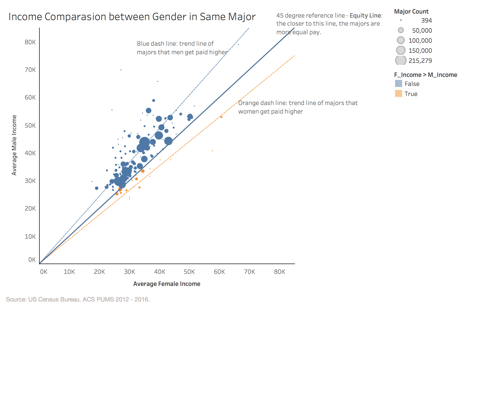

The graphs can be viewed on Tableau Public:
[link](https://public.tableau.com/profile/feng.wang2440#!/vizhome/gender_income_with_major_category/Dashboard1?publish=yes)

To see more detail, we generate a chart that compare income between gender in same majors. The graph represents early career average income between gender and over majors, the middle line (45% degree reference line) is a equity line, which means the closer to this line, the majors are more equal paid. The blue dash line and orange dash line are trend line in each group: blue group means female income is less than male income in same major, and vice versa in orange line. We can see that there are lots of majors with higher men’s income.

### Why this finding is important to our audience? 
Social norms always emphasize on women get less pay than men. In this finding, we demonstrate that the pay gap is not because women is being pushed into lower-paying jobs, but because women choose the majors that leads to lower-paying work.

Major does play an important role in gender pay gap. If income is the only factor they consider when choosing major, parents and students, particularly female students, should make a considerable choice in choosing majors.

## Finding 3: Compared to other majors, Business and psychology graduates are working in a wider variety of occupations, but for different reasons.
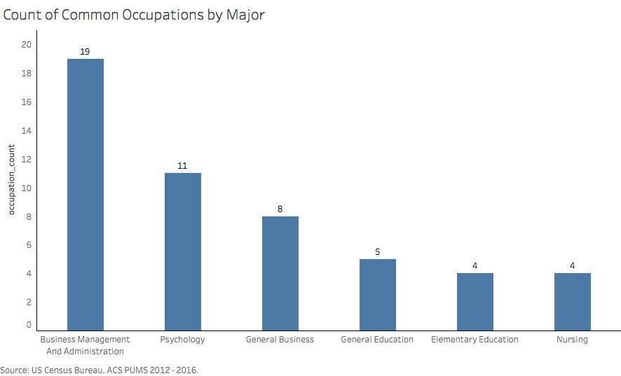

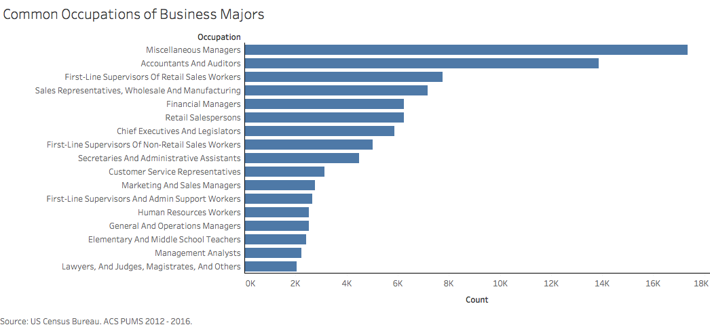

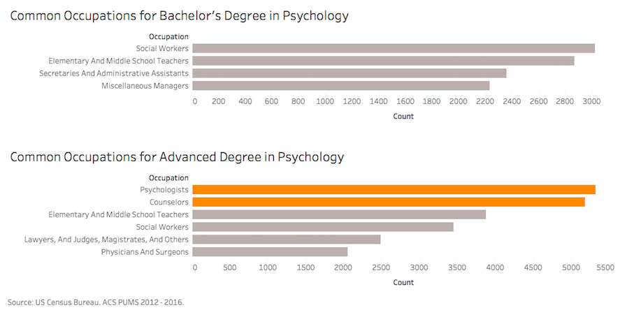

The graphs can be viewed on Tableau Public:

[link_graph1](https://public.tableau.com/profile/tianmin.li#!/vizhome/common_occupation/Sheet1),

[link_graph2](https://public.tableau.com/profile/tianmin.li#!/vizhome/common_occupation_business/Sheet2),

[link_graph3](https://public.tableau.com/profile/tianmin.li#!/vizhome/psychology/Dashboard1),

### Description
The first graph demonstrates that Business and Psychology graduates work in a much wider variety of occupations compared with Education and Nursing. To understand the reasons of this phenomenon, the second and third graph are drawn to see the occupations chosen by graduates from these two majors. It is shown that Business graduates can apply their skills in different industries. While most Psychology graduates with advanced degrees can practice psychology, most of those who only have a bachelor degree work in fields unrelated to their majors.

### Development Process:
To explore the occupations chosen by graduates, we look at the job placements of the top 6 popular majors. For each major, we only select common occupations with more than 2000 people participating in and omit minor categories to make a clear comparison. Unlike the first version, we use specific occupations instead of the industry so that we can have a clear understanding of what people are doing after graduation from a certain major. 

First, we developed a bar chart (graph 1) for the count of common occupations by major. Compared with Education and Nursing, Business and Psychology graduates work in a much wider variety of occupations. Then we graph what jobs are chosen by Business and Psychology graduates (graph 2 and 3) so as to figure out reasons of variety. 

We follow the audience model when developing our final version. We explore the occupations chosen by the graduates from the top 6 majors that our targeted audience, the high school seniors, will be interested in. In comparison with the first version, we replace the confusing stacked bar charts and adopt simple bar charts in all the above three graphs to convey the ideas clearly. Unnecessary background grids are removed and colors are chosen for different categories for a meaningful presentation. 

### Data Wrangling:
Read Data
```{r}
library(data.table)
library(dplyr)
library(knitr)
library(stringr)
library(DT)
library(tidyr)
df = fread('census_final.csv')
edu = fread('cen_final.txt')
major = fread('major_code.csv')
names(major) <- c('major_code','major')
occupation <- fread('OCCP.csv')
names(occupation)<-c('occupation_code','occupation')
```
Count common occupation by major and degree
```{r}
#get top 10 popular majors
top_major <- edu %>% group_by(FOD1P)%>% summarize(n=n()) %>%arrange(desc(n))
top_major<- top_major[1:10,1]
#count freq by major, occupation and degree (of 10 top popular majors)
tmp<- edu %>% group_by(FOD1P,OCCP, SCHL) %>% summarize(n=n()) %>%filter(!is.na(OCCP))%>%filter(FOD1P %in% top_major$FOD1P )
names(tmp)<-c('major_code','occupation_code','degree', 'count')
#get major name and only include occupations that have count over 2000
tmp <- merge(tmp,major, by = 'major_code')
tmp <- merge(tmp,occupation, by  = 'occupation_code')%>%filter(occupation_code>0)%>%filter(count>2000)
#export file
write.csv(tmp,'major_and_occupation_by_degree.csv')
```
### Reasoning：
Compared with Nursing and Education, it is clearly shown in the three graphs above that Business-related majors and Psychology graduates work in a large variety of positions. This could be explained by the fact that regardless of industry, almost every company or institution will hire business-major graduates to manage funds, initiate marketing, and maintain efficient operation while rely on business principles to prosper [8]. Thus, business graduates are not only in need in industries that provide financial and consulting services, but also in almost all other fields such as health care, entertainment, construction, education and etc. In contrast, people major in Nursing and Education are trained more career-oriented that the occupations they take are restricted in the area of healthcare and educational service respectively. This may be the reason why business and management degrees are so popular in the U.S. over the past eight decades as such majors open doors to more careers than other undergraduate majors.

Psychology, however, has a different story. Based on the graph, most psychology graduates with an advanced degree are working as psychologists or counsellors, while those who only have a bachelor’s degree work in fields unrelated to their majors. For those who want to practice psychology, he/ she must be licensed first and such a license typically requires a minimum of a doctoral degree in psychology from an accredited institution [9] Therefore, most psychology graduates with a bachelor’s degree cannot be a psychologist or counsellor. This may explain the reason why they need to find a job in other fields and thus their career choices are very diverse compared with other majors.

This is important to our targeted audience: high school seniors. The results not only help them understand the job placements of popular college majors, but also dig into the underlying reasons for better decision-making about college majors.

## Reference:
[1] U*X*L American Decades. The 1970s Education: Overview. Retrieved from: http://www.encyclopedia.com 

[2] History.com Staff (2011) -  Women in the Vietnam war. https://www.history.com/topics/vietnam-war/women-in-the-vietnam-war

[3] Ibiza Times (2015) - ‘The Hippie movement was a Psychological Operation’. Published on its website. Retrieved from:
https://ibizatimes.wordpress.com/2015/03/02/the-hippie-movement-was-a-psychological-operation/

[4] Barry Nielsen (2017) - ‘Stagflation, 1970s Style’. Published on investopedia. Retrieved from: https://www.investopedia.com/articles/economics/08/1970-stagflation.asp

[5] National Center for Health Statistics - ‘Health, United States, 2016 - Individual Charts and Tables: Spreadsheet, PDF, and PowerPoint files’. Retrieved from:
https://www.cdc.gov/nchs/hus/contents2016.htm#mentalhealth

[6] Perry M. (2017). Table of the day: Bachelor’s degrees by field and gender for the Class of 2015. AEI. Retrieved from http://www.aei.org/publication/table-of-the-day-bachelors-degrees-by-field-and-gender-for-the-class-of-2015/

[7] Zafar B. (2009). College major choice and the gender gap, Staff Report, Federal Reserve Bank of New York, No. 364, Federal Reserve Bank of New York, New York, NY. Retrieved from https://www.newyorkfed.org/medialibrary/media/research/staff_reports/sr364.pdf  

[8] Schweitzer K. (2018) Reasons to Choose a Business Major. Retrieved from: https://www.thoughtco.com/reasons-to-become-a-business-major-467074 

[9] DITTMANN M. What you need to know to get licensed. Retrieved from: http://www.apa.org/gradpsych/2004/01/get-licensed.aspx 

